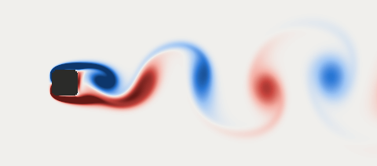

# vortexlab

A small two-dimensional wind tunnel in software: a lattice-Boltzmann flow solver written from scratch in Rust
(no dependencies), **held to published benchmark numbers the way an engineering tool would be**, and then used for
one experiment: what the notched "saw-tooth" corners of Taipei 101 do to the vortices that shake a square tower.

Fluid toys in the browser are everywhere and this is not a new method; production lattice-Boltzmann codes are
listed under [Related work](#related-work). What this repository adds is the checking: every result below comes
with the reference value it was compared against, where it lands relative to the published interval at each
resolution, and the command that reproduces it.

繁體中文說明：[README.zh-TW.md](README.zh-TW.md) · 白話導讀：[docs/導讀.zh-TW.md](docs/導讀.zh-TW.md)

| Check | Reference | Result (finest grid) |
|---|---|---|
| Channel flow, exact parabola | analytic | observed order 2.000; exact to rounding (10⁻¹¹ or better) with TRT, Λ = 3/16 |
| Lid-driven cavity, Re = 1000 | Botella & Peyret (1998), spectral | centreline extrema within 0.20 % at 257 × 257 |
| Lid-driven cavity, Re = 100, 1000 | Ghia, Ghia & Shin (1982) table | max deviation 0.008 / 0.016 of the lid speed, located where Ghia's table itself is 2-3 % off the spectral values |
| Cylinder, steady, Re = 20 (2D-1) | Schäfer & Turek (1996) intervals | c_D, c_L, ΔP inside; recirculation length 0.2 % below its interval |
| Cylinder, periodic, Re = 100 (2D-2) | Schäfer & Turek (1996) intervals | c_Dmax, c_Lmax, St, ΔP inside at 80 cells per diameter; c_Dmax 0.07 % above at 40; diverges at 10 |
| Same result for any thread count | — | bit-identical populations and forces with 1, 2, 3, 4, 7 threads |

The full tables, convergence plots, force histories and animations are in the generated report,
**[docs/report/index.html](docs/report/index.html)** (static HTML, no scripts; open the file in a browser).



## Demo

`make demo` (or double-click **`跑跑看.command`** on macOS) runs the Schäfer-Turek cylinder benchmark on a coarse
grid and then a vortex street with an animation. Real output:

```
$ ./target/release/vortexlab demo
[1/2] Benchmark: flow past a cylinder in a channel, Schafer & Turek (1996) case 2D-2, Re = 100
      20 cells per diameter (coarse on purpose, so it finishes in seconds).
      quantity     computed     published interval
      c_D max        3.3244       3.2200 - 3.2400   above
      c_L max        0.9807       0.9900 - 1.0100   below
      St             0.2988       0.2950 - 0.3050   inside
      dP             2.4700       2.4600 - 2.5000   inside
      (7 s; finer grids land closer: see the report)

[2/2] Vortex street behind a circular cylinder in a uniform stream, Re = 150
   20%  t =   18.0 D/U   Cd =  1.196   Cl = +0.266
   ...
{{DEMO_TAIL}}
```

### Bring your own shape

Any PNG with a dark shape on a light (or transparent) background works; the flow comes from the left.

```
$ ./target/release/vortexlab shape 我的形狀/機翼.png --re 150 --cells 60 --units 100
{{SHAPE_OUT}}
```

It writes `wake.png`, `vorticity.gif` (one shedding period, looped) and `forces.csv` next to the picture. Options:
`--re` Reynolds number, `--cells` cells across the longer side of the shape, `--angle` rotation in degrees,
`--units` run length in convective time units D/U, `--u` lattice velocity (Mach number = 1.73 u). The PNG reader
(DEFLATE included) and the GIF writer are part of this crate. Two sample shapes are in `我的形狀/`.

## How it works

```
 populations f_0..f_8 at every node (D2Q9)          one time step
 ┌──────────────────────────────────────┐   1. bulk nodes, in parallel: pull the nine populations from the
 │ 6  2  5      stream: f_i moves one   │      upstream neighbours in array A, collide (BGK or TRT), write B
 │  \ | /       cell along c_i          │   2. boundary nodes, serial, fixed order: for every link that ends
 │ 3--0--1      collide: relax towards  │      in a wall / inlet / outlet, build the returning population
 │  / | \       local equilibrium       │      (interpolated bounce-back, moving wall, pressure), collide,
 │ 7  4  8                              │      add the momentum handed to the body to its force
 └──────────────────────────────────────┘   3. swap A and B
```

* **Collision** (`src/lattice.rs`): BGK and two-relaxation-time (TRT). TRT with Λ = 3/16 puts a bounce-back wall
  exactly halfway between nodes; all production runs use it.
* **Curved bodies** (`src/geometry.rs`, `src/sim.rs`): for every lattice link cut by the body the fraction `q` of
  the link in the fluid is found by bisection, and the interpolated bounce-back rule of Bouzidi et al. (2001) uses
  it, so a circle is a circle rather than a staircase. Shapes are anything with an `inside(x, y)` test, including
  the 0.5-contour of a bilinearly interpolated picture.
* **Forces**: momentum exchange on the cut links, in the Galilean-invariant form of Wen et al. (2014).
* **Strouhal number** (`src/signal.rs`): own radix-2 FFT of the lift history, Hann window, zero padding, parabolic
  peak interpolation; cross-checked with the mean spacing of zero crossings.
* **Open boundaries**: velocity inlet; an outlet and side boundaries that let sound waves leave. Without them the
  tunnel is an organ pipe and the drag signal wanders by ±10 %; see [docs/DESIGN.md](docs/DESIGN.md), section 3.2,
  for how that was found and fixed.
* **Determinism**: a node's new value depends only on the old array, and everything that is summed is summed
  serially in a fixed order, so results do not depend on the thread count, bit for bit.

### Units

The solver works in lattice units (cell = 1, step = 1). Two choices tie a run to a physical flow: `D` cells across
the body, and the lattice velocity `U` that stands for the physical stream velocity. Then
`dx = D_phys / D`, `dt = dx · U / U_phys`, and the viscosity follows from the Reynolds number:
`nu = U D / Re`, `tau = 3 nu + 1/2`. Two limits apply: the Mach number `Ma = U √3` must be small because the
method's compressibility error grows like Ma² (runs here use Ma = 0.07-0.17, and each validation table has a
half-Mach row showing the effect), and `tau` must stay clear of 1/2 (below about 0.51 the grid cannot resolve the
gradients and the run may diverge). `src/units.rs` implements the conversions; the CLI prints every result also
for a 1 cm body in air and in water.

## Validation

Reproduce with `make validate` (all cases, full resolution: 12 min on an otherwise idle machine, 22 min when the
machine was busy; 4 threads) and `make report`. Reference values and their sources are in
[`data/reference/`](data/reference) and [docs/REFERENCES.md](docs/REFERENCES.md). ✓ = inside the published
interval, ✗ = outside (distance to the interval in brackets).

### Poiseuille flow against the exact profile

| scheme | rows 8 → 128, relative L2 error | observed order |
|---|---|---|
| BGK, halfway wall | 1.1e-2 → 4.3e-5 | 2.000 |
| TRT Λ = 1/4, halfway wall | 7.1e-3 → 2.8e-5 | 2.000 |
| TRT Λ = 3/16, halfway wall | 3e-15 … 2e-11 | exact (rounding) |
| TRT Λ = 3/16, wall at q = 0.25 (interpolated) | 3.4e-2 → 1.1e-4 | 2.003 |
| TRT Λ = 3/16, wall at q = 0.80 (interpolated) | 1.5e-2 → 6.9e-5 | 1.997 |

The drag on the walls from the momentum-exchange evaluation equals the driving force to 10 digits.

### Lid-driven cavity

Deviation from the 2 × 15 interior points of Ghia's Tables I and II, and the profile extrema relative to the
spectral values of Botella & Peyret:

| Re | grid | max dev. from Ghia (u, v) | u_min | v_max | v_min |
|---|---|---|---|---|---|
| 100 | 65² | 0.0048, 0.0079 | −0.21354 (−0.24 %) | 0.17882 (−0.42 %) | −0.25245 (−0.53 %) |
| 100 | 129² | 0.0050, 0.0084 | −0.21384 (−0.10 %) | 0.17918 (−0.22 %) | −0.25301 (−0.31 %) |
| 1000 | 65² | 0.0167, 0.0087 | −0.37995 (−2.22 %) | 0.36766 (−2.46 %) | −0.51217 (−2.83 %) |
| 1000 | 129² | 0.0045, 0.0115 | −0.38676 (−0.47 %) | 0.37501 (−0.51 %) | −0.52401 (−0.58 %) |
| 1000 | 257² | 0.0061, 0.0158 | −0.38798 (−0.15 %) | 0.37638 (−0.15 %) | −0.52600 (−0.20 %) |
| 100 | Ghia 129² | — | −0.21090 (−1.47 %) | 0.17527 (−2.40 %) | −0.24533 (−3.34 %) |
| 1000 | Ghia 129² | — | −0.38289 (−1.46 %) | 0.37095 (−1.59 %) | −0.51550 (−2.20 %) |

The deviation from Ghia's table does not fall with resolution, and at Re = 1000 it grows. The reason is in the
last two rows: Ghia's table is a second-order solution on 129² and is itself 1.5-3.3 % away from the spectral
benchmark at its extrema. The solver converges to the spectral values (2.2 % → 0.47 % → 0.15 % at Re = 1000) and
therefore away from Ghia's numbers where the two differ. The Botella-Peyret values are quoted second-hand (see
REFERENCES.md).

### Schäfer-Turek cylinder benchmark

Case 2D-1 (steady, Re = 20):

| cells per D | lattice U | c_D | c_L | L_a (m) | ΔP (Pa) |
|---|---|---|---|---|---|
| 10 | 0.04 | ✗ 5.6132 (+0.42 %) | ✓ 0.01050 | ✗ 0.0802 (−4.7 %) | ✗ 0.1133 (−3.4 %) |
| 20 | 0.04 | ✓ 5.5891 | ✓ 0.01052 | ✗ 0.0834 (−1.0 %) | ✗ 0.1159 (−1.1 %) |
| 40 | 0.04 | ✓ 5.5789 | ✓ 0.01079 | ✗ 0.0838 (−0.4 %) | ✗ 0.1170 (−0.17 %) |
| 80 | 0.04 | ✓ 5.5774 | ✓ 0.01079 | ✗ 0.0840 (−0.2 %) | ✓ 0.1173 |
| 20 | 0.02 | ✗ 5.5928 (+0.05 %) | ✗ 0.01037 (−0.3 %) | ✗ 0.0838 (−0.5 %) | ✗ 0.1162 (−0.9 %) |
| 1996 interval | | 5.57 – 5.59 | 0.0104 – 0.0110 | 0.0842 – 0.0852 | 0.1172 – 0.1176 |
| later reference | | 5.57954 | 0.010619 | — | 0.11752 |

Case 2D-2 (periodic, Re = 100; ΔP half a period after the lift maximum):

| cells per D | lattice U | c_D max | c_D min | c_L max | c_L min | St | ΔP (Pa) |
|---|---|---|---|---|---|---|---|
| 10 | 0.05 | diverges | | | | | |
| 20 | 0.05 | ✗ 3.3244 (+2.6 %) | 3.2719 | ✗ 0.9807 (−0.9 %) | −1.0175 | ✓ 0.2988 | ✓ 2.4700 |
| 40 | 0.05 | ✗ 3.2423 (+0.07 %) | 3.1919 | ✗ 0.9830 (−0.7 %) | −1.0181 | ✓ 0.3006 | ✓ 2.4734 |
| 80 | 0.05 | ✓ 3.2354 | 3.1840 | ✓ 0.9947 | −1.0295 | ✓ 0.3007 | ✓ 2.4840 |
| 20 | 0.025 | ✗ 3.3268 (+2.7 %) | 3.2633 | ✗ 0.9797 (−1.0 %) | −1.0167 | ✓ 0.2995 | ✓ 2.4746 |
{{ROW_40_0025}}
| 1996 interval | | 3.22 – 3.24 | — | 0.99 – 1.01 | — | 0.295 – 0.305 | 2.46 – 2.50 |
| later reference | | 3.2274 | 3.1643 | 0.9866 | −1.0213 | 0.3018 | 2.4848 |

What these tables say, including the unflattering parts:

* **Steady case.** Drag converges to within 0.04 % of the later spectral value and the pressure difference enters
  its interval at 80 cells per diameter. The recirculation length converges from below and is still 0.2 % short of
  the interval at 80 cells; it is measured by linear interpolation of the centreline velocity between nodes.
* **Periodic case, maxima.** All four benchmark quantities are inside the 1996 intervals at 80 cells per diameter.
  The 1996 interval for the maximum lift does not contain the later reference value (0.9866), so "inside" is not
  the same as "right": at 80 cells this solver's maximum lift is 0.8 % above the later value, and at 40 cells it
  was 0.4 % below. The lift amplitude does not converge monotonically.
* **Periodic case, drag oscillation.** The peak-to-peak drag variation is 0.051 here against 0.063 in the later
  reference, 18 % too small at lattice velocity 0.05, and it does not improve with resolution. It does improve at
  half the velocity (0.063 at 20 cells): this is a compressibility effect. The channel is 22 diameters long, and
  the time sound needs to cross it is comparable to the period of the drag oscillation, so the pressure field
  cannot adjust along the whole channel "instantly" as it does in an incompressible fluid. The mean drag and the
  shedding frequency are much less sensitive. A 2D-2 result closer to the reference would need a lower Mach
  number (cost grows in proportion) rather than more cells.
* **Coarse grids.** At 10 cells per diameter the periodic case diverges (relaxation time 0.515); the program
  reports that rather than printing numbers.

## The Taipei 101 experiment

Taipei 101's plan is a square whose corners step inwards twice. Its structural engineers write that in the
wind-tunnel studies "a square tower with sharp corners creates large crosswind excitation. Rounded and chamfered
(45°) corners reduced lateral response, but a 'saw tooth' or 'double notch' corner with 2.5 m (8.2 ft) notches
achieved a dramatic reduction" (Poon, Shieh, Joseph & Chang 2004), and Irwin (2008) of the wind-tunnel laboratory
RWDI reports that softening the corners "reduced the base wind-induced base bending moments by approximately 25%".

Here five sections of equal width D are put in the same tunnel (uniform stream, 5 % blockage, zero incidence):
sharp, chamfered (0.1 D legs), rounded (radius 0.1 D), single recess (0.1 D notch) and double recess (two steps of
0.05 D). `make corners` reproduces everything (about 50 min for the main set, 30 min for the others; 4 threads).

{{CORNERS}}

**What this can and cannot say.** The simulation is two-dimensional and laminar at Reynolds number 100-200. The
tower is three-dimensional, in a turbulent sheared wind, at a Reynolds number of order 10⁸, and what was measured
for it is a structural response (base moment, acceleration), which also depends on how well the shedding is
correlated along the height and how close its frequency is to the building's natural frequency.

* *Reproduced qualitatively:* published work on corner-modified square cylinders reports lower drag and a narrower
  wake for chamfered and rounded corners (Tamura & Miyagi 1999, as summarised by Dey & Das 2016) and a rising
  Strouhal number with corner rounding (Miran & Sohn 2015, Re = 500). The same directions appear here.
* *Not reproduced, and not expected to be:* the designers' observation that the double notch is far more effective
  than chamfering or rounding. In this laminar 2-D model the modified sections behave almost alike. The mechanisms
  usually credited at full scale (the notch disrupting the separated shear layer and its reattachment in a
  turbulent flow, loss of spanwise correlation) are absent from the model.
* *Not comparable at all:* the 25 % base-moment reduction. Nothing here is a base moment, and no percentage from
  this page should be set against it.
* No published 2-D laminar study of recessed corners was found, so the recessed results have no direct comparator;
  the plain square is compared with Sohankar, Norberg & Davidson (1998) in the report.

## Performance

{{BENCH}}

## Tests

`make test` runs 68 tests in about half a minute:

* unit tests: lattice isotropy, equilibrium moments, collision invariants (BGK, TRT, forced), FFT against a naive
  DFT, peak and frequency estimation, units, geometry, PNG/DEFLATE and GIF/LZW round trips and corruption handling
  (truncated files, random input, decompression bombs), colour-map ordering, charts;
* solver tests (`tests/solver.rs`): mass and momentum conservation to rounding in a periodic box, exact impulse
  from a body force, mass in a closed box, Couette flow seen from four moving frames (wall shear equals
  ρν dU/dy to 1e-12), zero force on a body moving with the stream, a uniform stream passing the open
  boundaries unchanged, developed channel flow driven by inlet and outlet, bit-identical results across thread
  counts, absorption of sound by the outlet;
* codec tests (`tests/codecs.rs`): the PNG reader against files written by Python's zlib (an independent encoder);
* regression tests (`tests/validation.rs`): every validation case on a small grid with fixed tolerances against
  the published numbers, and a miniature corner experiment.

CI (`.github/workflows/ci.yml`) runs formatting, clippy, the tests, the quick validation set, the demo and a
user-shape run on Ubuntu.

## Limitations

* Two-dimensional, laminar, uniform grid. No turbulence model, no grid refinement, no moving bodies.
* Weakly compressible: errors of order Ma², visible in unsteady forces when the domain is long compared with the
  distance sound travels in one oscillation (see the 2D-2 discussion).
* Open boundaries are first-order. The outlet absorbs plane waves only; the side boundaries of the tunnel are
  slightly permeable to the mean flow (of order Ma).
* The interpolated bounce-back rule does not conserve mass exactly, and falls back to plain bounce-back in concave
  corners one cell wide, so features thinner than about three cells are poorly represented.
* The square-section results are grid-sensitive at the sharp corners (see the coarse-grid set in the report).
* PNG input must be non-interlaced; the PNG writer uses fixed Huffman codes only.
* Performance numbers were taken on a machine shared with other jobs.
* The method-paper formulas were implemented from their standard textbook forms and verified by the tests here,
  not checked line by line against the original papers; which sources were actually read is stated per entry in
  docs/REFERENCES.md.

## Related work

Production lattice-Boltzmann codes: **Palabos** (Latt et al. 2021), **OpenLB** (Krause et al. 2021),
**waLBerla** (Bauer et al. 2021), **Sailfish** (Januszewski & Kostur 2014, GPU) and **lbmpy** (Bauer, Köstler &
Rüde 2021, code generation). They offer three dimensions, many collision models, grid refinement, turbulence
models, massive parallelism and far more validation than this repository. vortexlab is a small educational solver
with none of that; it shares no code with them. Its purpose was to learn the method by building every layer
(collision, boundaries, force evaluation, spectral analysis, image codecs, report) and to practise checking a
numerical tool against the literature honestly. Full citations: [docs/REFERENCES.md](docs/REFERENCES.md).

## Build

Requires a recent stable Rust (built and tested with 1.98). Nothing else: no dependencies, no network, no ports.

```
make build      # cargo build --release
make test       # all tests
make lint       # rustfmt + clippy
make demo       # coarse benchmark + animated vortex street
make quick      # every validation case on small grids (about a minute)
make validate   # full validation
make corners    # corner experiment
make bench      # MLUPS
make report     # regenerate docs/report from results/
```

Layout: `src/lattice.rs` collision · `src/sim.rs` solver core · `src/geometry.rs` shapes · `src/cases/` the
experiments · `src/signal.rs` FFT · `src/png.rs`, `src/gif.rs` codecs · `src/render.rs` colour map ·
`src/svg.rs`, `src/report.rs` report · `data/reference/` published values · `tests/` · `docs/`.

## License

MIT, see [LICENSE](LICENSE).
